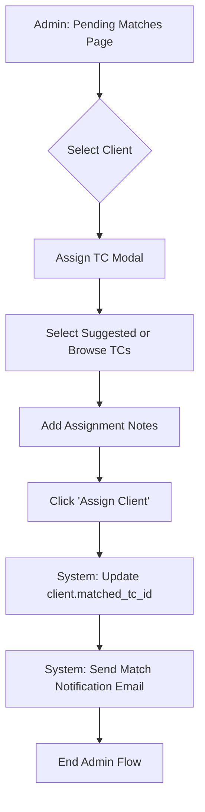

# Session Allocation Flow

This document describes the updated session allocation and booking flow for Vanquish Therapies.

## 1. Overview

The session allocation logic has been shifted from administrative assignment to client selection. Admins now only assign the Trainee Counsellor (TC) to the client. The client is then notified via email and selects their own session slots based on the TC's availability.

## 2. Updated Flow Diagram

### 2.1 Admin Flow (Match Assignment)



### 2.2 Client Flow (Session Booking)

```mermaid
graph TD
    A[Client: Receive Email] --> B[Click 'Book Your First Session' link]
    B --> C[Web: Client Booking Portal]
    C --> D{Service Type?}

    D -- "Low Cost / Mid Range" --> E{Slot Pre-allocated?}
    E -- No --> F[Select Weekly Slot from TC Availability]
    E -- Yes --> G[Confirm Pre-allocated Slot]

    D -- "Counselling & Coaching" --> H[Select Single Session Slot]

    F --> I[Proceed to Payment]
    G --> I
    H --> I

    I -- Payment Success --> J[System: Create Session(s)]
    J -- If Block --> K[Set client.allocated_day & time]
    K --> L[Notify TC & Client]
    J --> L
```

## 3. Key Logic Changes

### 3.1 Backend (Laravel)

- **`ClientController@assignMatch`**: Removed `allocated_day` and `allocated_time` parameters. Admins no longer pick slots.
- **`ClientBookingController@getAvailableSlots`**:
  - Fetches TC availability.
  - Prevents double booking by checking against existing `scheduled` or `completed` sessions.
  - Enforces a 48-hour advance booking rule for Low Cost and Mid Range services.
- **`ClientBookingController@bookSession / bookBlock`**:
  - Validates slot availability at the moment of booking to prevent race conditions.
  - Dynamically updates the client's recurring slot (`allocated_day` and `allocated_time`) if they select one for the first time.

### 3.2 Frontend (React/Next.js)

- **`PendingMatchesPage`**: Simplified the assignment modal by removing slot selection UI. Added informational text about the client's role in booking.
- **`ClientBookingPage`**: Enhanced to support slot selection for block bookings when no pre-allocation exists.

## 4. Double Booking Prevention

Prevention is implemented at multiple levels:

1. **Frontend**: Booked slots are filtered out (marked as disabled) in the UI.
2. **Backend (Read)**: `getAvailableSlots` excludes any slots that overlap with existing sessions.
3. **Backend (Write)**: `bookSession` and `bookBlock` perform a final database check before inserting new session records.
